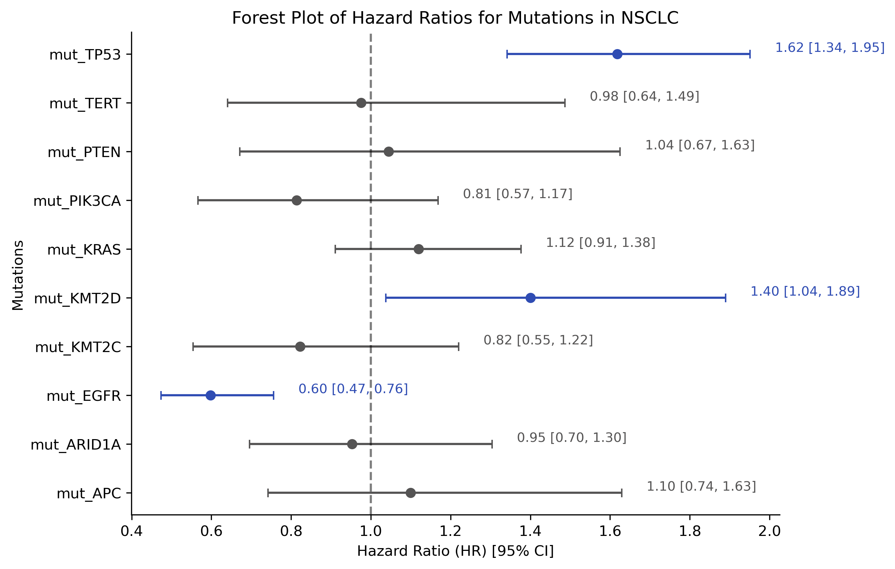
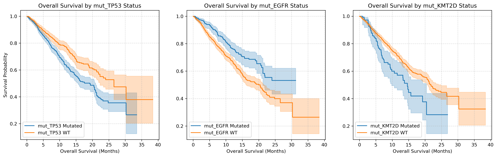

# EHR Clinical Risk and Genomic Survival Analysis

Portfolio project that evaluates genomic risk factors in NSCLC (Non-Small Cell Lung Cancer) cohorts.

## Visual Highlights

### Multivariable Forest Plot

### Kaplan-Meier Survival Curves

---
## Key Findings
* Identified key genomic biomarkers impacting patient hazard ratios.
* Built and validated Cox Proportional Hazards model.
* Visualized survival probability differences.
---
## Tech Stack/Libraries
* Language: Python
* Analysis and Statistics: `lifelines`, `pandas`, `numpy`
* Visualization: `matplotlib`
